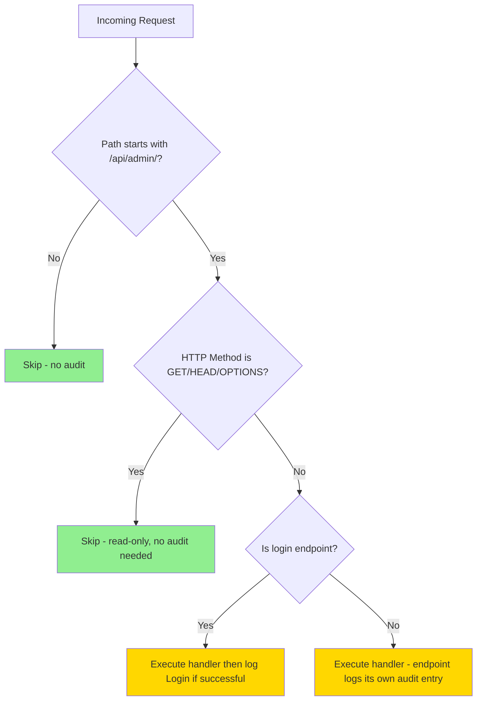

# Audit Log Cleanup & Resource Optimization Plan

## Problem Statement

The Commander API audit system generates hundreds of useless log entries that:
- Pollute the audit log with read-only query noise (player counts, account searches, etc.)
- Double-log mutation actions (middleware + explicit endpoint logging)
- Waste server memory and CPU cycles
- Push meaningful entries out of the 1000-entry cap

Based on the screenshot, the only truly necessary audit entry was `UnbanAccount`. Everything else (API player count, GET queries, etc.) is noise.

---

## Finding 1: Middleware Logs ALL Requests Including Read-Only GETs

**File:** [`AuditLogMiddleware.cs`](Projects/CommanderApi/Middleware/AuditLogMiddleware.cs)

The middleware currently logs **every** request to `/api/admin/*` except two skipped paths. This means every dashboard poll, every player list refresh, every account search generates an audit entry.

### Noisy GET endpoints currently being audited:

| Endpoint | Why Its Useless |
|---|---|
| `GET /api/admin/players/` | Player list - polled frequently by dashboard |
| `GET /api/admin/players/search` | Search - read-only lookup |
| `GET /api/admin/players/{serial}` | Player detail - read-only |
| `GET /api/admin/players/{serial}/equipment` | Equipment - read-only |
| `GET /api/admin/players/{serial}/backpack` | Backpack - read-only |
| `GET /api/admin/players/{serial}/skills` | Skills - read-only |
| `GET /api/admin/players/{serial}/properties` | Properties - read-only |
| `GET /api/admin/accounts/` | Account list - read-only |
| `GET /api/admin/accounts/search` | Account search - read-only |
| `GET /api/admin/accounts/by-ip/{ip}` | IP lookup - read-only |
| `GET /api/admin/accounts/{username}` | Account detail - read-only |
| `GET /api/admin/accounts/{username}/characters` | Characters - read-only |
| `GET /api/admin/world/stats` | World stats - polled frequently |
| `GET /api/admin/world/items/{serial}` | Item detail - read-only |
| `GET /api/admin/world/audit-log` | Audit log itself - meta! |

### Fix: Skip all GET requests in the middleware

Read-only operations should never produce audit entries. Only mutations (POST/PUT/DELETE) matter for auditing, and those are already explicitly logged in the endpoint handlers.

---

## Finding 2: Double Logging of Mutation Actions

Every POST mutation is logged **twice**:

1. **Middleware** logs it as `"POST /api/admin/accounts/testuser/unban"` (generic HTTP action)
2. **Endpoint** logs it as `"UnbanAccount"` with `username` as target (descriptive, meaningful)

Example for `UnbanAccount`:
- Middleware creates: `action = "POST /api/admin/accounts/testuser/unban"`, `target = "/api/admin/accounts/testuser/unban"`
- Endpoint creates: `action = "UnbanAccount"`, `target = "testuser"`

### Fix: Remove automatic POST/PUT/DELETE logging from middleware

The explicit endpoint-level `auditLog.Log()` calls are more descriptive and sufficient. The middleware should only handle the special login case (which has no explicit endpoint logging).

---

## Finding 3: AuditLogService Double-Writes to Server Log

**File:** [`AuditLogService.cs`](Projects/CommanderApi/Services/AuditLogService.cs:37)

Every `Log()` call writes to BOTH:
1. The in-memory `ConcurrentQueue<AuditLogEntry>` (for the API endpoint)
2. `logger.Information()` (ModernUO server log)

This means every audit entry is persisted twice. The server log write is redundant since the data is already queryable via `GET /api/admin/world/audit-log`.

### Fix: Remove the `logger.Information()` call from `AuditLogService.Log()`

The in-memory queue is the authoritative source. The server log should only be used for operational diagnostics, not audit trail duplication.

---

## Finding 4: AdminRateLimitMiddleware Memory Leak

**File:** [`AdminRateLimitMiddleware.cs`](Projects/CommanderApi/Middleware/AdminRateLimitMiddleware.cs:15)

The `ConcurrentDictionary<string, RateLimitEntry>` uses composite keys `"{clientIp}:{path}"` and **never evicts old entries**. Over time this dictionary grows unboundedly.

### Fix: Add periodic cleanup of stale rate limit entries

Add a background cleanup that removes entries older than the rate limit window (1 minute). This can be done simply by checking and purging on each request, or with a timer.

---

## Finding 5: Redundant _skipPaths After GET-Skip

**File:** [`AuditLogMiddleware.cs`](Projects/CommanderApi/Middleware/AuditLogMiddleware.cs:19)

After implementing the GET-skip, the existing `_skipPaths` set becomes partially redundant:
- `/api/admin/auth/verify` - GET, will be skipped automatically
- `/api/admin/server/status` - GET, will be skipped automatically

### Fix: Remove `_skipPaths` entirely since all GETs are skipped

The login special-case (POST to `/api/admin/auth/login`) still needs to be handled separately.

---

## Implementation Steps

### Step 1: Refactor AuditLogMiddleware to skip GET requests and remove automatic POST logging

The middleware should:
- Skip ALL GET/OPTIONS/HEAD requests (read-only, no audit value)
- Skip automatic logging of POST/PUT/DELETE (endpoints handle this explicitly)
- Keep only the special login audit case
- Remove the `_skipPaths` set (no longer needed)

**Before:**
```csharp
// Logs ALL /api/admin/ requests except _skipPaths
if (_skipPaths.Contains(path)) { ... skip ... }
if (!path.StartsWith("/api/admin/")) { ... skip ... }
if (path.EndsWith("/auth/login")) { ... special handling ... }
// Logs everything else
auditLog.Log(actor, action, path, queryString, success);
```

**After:**
```csharp
// Only audit non-GET requests to /api/admin/
if (!path.StartsWith("/api/admin/")) { ... skip ... }
if (context.Request.Method.Equals("GET", StringComparison.OrdinalIgnoreCase) ||
    context.Request.Method.Equals("HEAD", StringComparison.OrdinalIgnoreCase) ||
    context.Request.Method.Equals("OPTIONS", StringComparison.OrdinalIgnoreCase))
{ ... skip - read-only ... }

// Only special case: login (no authenticated user yet)
if (path.EndsWith("/auth/login", StringComparison.OrdinalIgnoreCase))
{ ... special handling, log login ... }

// All other POST/PUT/DELETE are logged explicitly by endpoints - no middleware logging
await _next(context);
```

### Step 2: Remove logger.Information from AuditLogService.Log()

Remove lines 37-40 in [`AuditLogService.cs`](Projects/CommanderApi/Services/AuditLogService.cs:37):
```csharp
// REMOVE THIS:
logger.Information(
    "Commander API Audit: {Actor} performed {Action} on {Target} (success: {Success})",
    actor, action, target ?? "N/A", success
);
```

### Step 3: Add stale entry cleanup to AdminRateLimitMiddleware

Add periodic eviction of entries older than 1 minute to prevent unbounded memory growth.

### Step 4: Verify no other unnecessary logging in services

Scan service files for `logger.Information` calls that are redundant with audit logging.

---

## Audit Actions That WILL Remain (The Important Ones)

These are all explicitly logged in endpoint handlers and represent meaningful admin actions:

| Action | Endpoint | File |
|---|---|---|
| Login | POST /api/admin/auth/login | AuditLogMiddleware |
| ServerSave | POST /api/admin/server/save | ServerEndpoints.cs |
| ServerShutdown | POST /api/admin/server/shutdown | ServerEndpoints.cs |
| ServerRestart | POST /api/admin/server/restart | ServerEndpoints.cs |
| Broadcast | POST /api/admin/server/broadcast | ServerEndpoints.cs |
| StaffMessage | POST /api/admin/server/staff-message | ServerEndpoints.cs |
| KickPlayer | POST /api/admin/players/{serial}/kick | PlayerEndpoints.cs |
| BanPlayer | POST /api/admin/players/{serial}/ban | PlayerEndpoints.cs |
| UnbanPlayer | POST /api/admin/players/{serial}/unban | PlayerEndpoints.cs |
| BanAccount | POST /api/admin/accounts/{username}/ban | AccountEndpoints.cs |
| UnbanAccount | POST /api/admin/accounts/{username}/unban | AccountEndpoints.cs |
| ChangeAccessLevel | POST /api/admin/accounts/{username}/access-level | AccountEndpoints.cs |

---

## Flow Diagram


