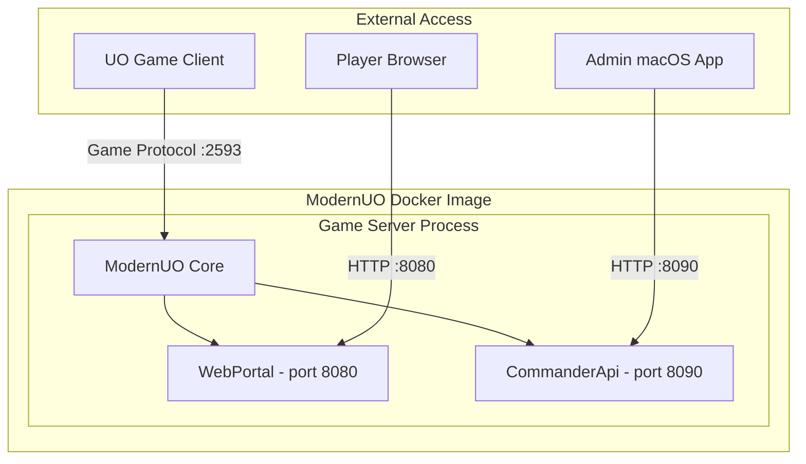
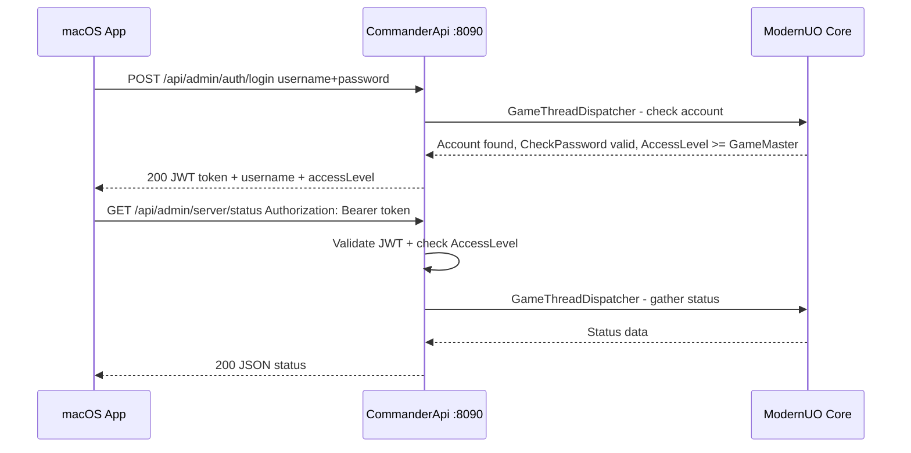

# Commander API — Architecture Plan

## Overview

Rebuild the UO Commander server-side API from scratch, following the **proven WebPortal pattern** (ASP.NET Core + Kestrel + DI) instead of the failed `HttpListener` approach from the old `uo-commander`. The new API will be a separate ModernUO project (`Projects/CommanderApi/`) that injects into the ModernUO build at Docker image creation time — exactly like WebPortal does today.

**Key principle:** Server-first. Build and validate the API inside the ModernUO image first, then build the macOS Swift client against it.

---

## Why the Old Approach Failed

| Problem | Old `uo-commander` | New `CommanderApi` |
|---------|-------------------|-------------------|
| HTTP server | Raw `HttpListener` — no DI, no middleware pipeline | ASP.NET Core Kestrel — full middleware, DI, auth pipeline |
| JWT | Hand-rolled `JwtHelper.cs` — no token rotation, no refresh | Microsoft.IdentityModel + JWT Bearer — proven, secure |
| Architecture | Monolithic 1104-line `HttpApiServer.cs` | Separated endpoints/services/models following WebPortal pattern |
| Thread safety | Mixed `EventLoopContext.ExecuteOnGameThread` calls, some missing | `GameThreadDispatcher` with `Core.LoopContext.Post` — proven in WebPortal |
| Build integration | `ModuleInitializer` hack — fragile, not patchable via Docker | Proper `.csproj` + Dockerfile patching — same as WebPortal |
| Port | 8081 — conflicted with no clear separation | **8090** — clearly separated from WebPortal's 8080 |
| Auth model | GameMaster+ only, no rate limiting, no lockout | GameMaster+ with rate limiting, lockout, audit logging |

---

## Architecture



### Dual HTTP Server Design

Both WebPortal and CommanderApi run **inside the same ModernUO process** but on different ports:

| Service | Port | Purpose | Auth Level |
|---------|------|---------|------------|
| WebPortal | 8080 | Player-facing: registration, login, dashboard | Any account |
| CommanderApi | 8090 | Admin-facing: server management, player control | GameMaster+ only |
| Game Server | 2593 | UO client protocol | Any account |

---

## Project Structure

```
Projects/CommanderApi/
├── CommanderApi.csproj
├── CommanderApiHost.cs              # Entry point: Configure + Initialize
├── Configuration/
│   └── CommanderApiConfiguration.cs # Port, JWT, rate limits from modernuo.json
├── Endpoints/
│   ├── AuthEndpoints.cs             # Admin login, verify, logout
│   ├── ServerEndpoints.cs           # Status, save, shutdown, restart, broadcast
│   ├── PlayerEndpoints.cs           # List, search, details, kick, ban, equipment, skills
│   ├── AccountEndpoints.cs          # Search, details, ban, unban, access-level, characters
│   └── WorldEndpoints.cs            # World stats, item inspection
├── Middleware/
│   ├── AuditLogMiddleware.cs        # Log all admin actions with actor + timestamp
│   └── AdminRateLimitMiddleware.cs  # Rate limiting for admin API
├── Models/
│   ├── Requests.cs                  # LoginRequest, BroadcastRequest, etc.
│   └── Responses.cs                 # ServerStatusResponse, PlayerResponse, etc.
└── Services/
    ├── GameThreadDispatcher.cs      # Thread-safe game state access (from WebPortal)
    ├── AdminAuthService.cs          # GameMaster+ authentication logic
    ├── PlayerService.cs             # Player query + action operations
    ├── AccountService.cs            # Account query + action operations
    ├── ServerService.cs             # Server control operations
    └── AuditLogService.cs           # Persistent audit log
```

---

## API Endpoints

### Authentication — `/api/admin/auth`

| Method | Endpoint | Description | Auth Required |
|--------|----------|-------------|---------------|
| POST | `/api/admin/auth/login` | Login with GameMaster+ credentials | No |
| GET | `/api/admin/auth/verify` | Verify JWT token validity | Yes |
| POST | `/api/admin/auth/logout` | Invalidate session | Yes |

### Server Control — `/api/admin/server`

| Method | Endpoint | Description | Auth Required |
|--------|----------|-------------|---------------|
| GET | `/api/admin/server/status` | Server uptime, player count, memory, CPU | Yes |
| POST | `/api/admin/server/save` | Trigger world save | Yes |
| POST | `/api/admin/server/shutdown` | Shutdown server with optional save | Yes |
| POST | `/api/admin/server/restart` | Restart with configurable countdown | Yes |
| POST | `/api/admin/server/broadcast` | Broadcast message to all players | Yes |
| POST | `/api/admin/server/staff-message` | Message to staff only | Yes |

### Player Management — `/api/admin/players`

| Method | Endpoint | Description | Auth Required |
|--------|----------|-------------|---------------|
| GET | `/api/admin/players` | List all online players | Yes |
| GET | `/api/admin/players/search?name=X` | Search players by name | Yes |
| GET | `/api/admin/players/{serial}` | Player details: location, account, access level | Yes |
| POST | `/api/admin/players/{serial}/kick` | Kick player with reason | Yes |
| POST | `/api/admin/players/{serial}/ban` | Ban players account | Yes |
| POST | `/api/admin/players/{serial}/unban` | Unban players account | Yes |
| GET | `/api/admin/players/{serial}/equipment` | Equipped items list | Yes |
| GET | `/api/admin/players/{serial}/backpack` | Backpack contents | Yes |
| GET | `/api/admin/players/{serial}/skills` | Player skills | Yes |
| GET | `/api/admin/players/{serial}/properties` | Mobile properties inspector | Yes |

### Account Management — `/api/admin/accounts`

| Method | Endpoint | Description | Auth Required |
|--------|----------|-------------|---------------|
| GET | `/api/admin/accounts` | List all accounts - paged | Yes |
| GET | `/api/admin/accounts/search?username=X` | Search accounts by username | Yes |
| GET | `/api/admin/accounts/{username}` | Account details | Yes |
| POST | `/api/admin/accounts/{username}/ban` | Ban account with reason | Yes |
| POST | `/api/admin/accounts/{username}/unban` | Unban account | Yes |
| POST | `/api/admin/accounts/{username}/access-level` | Change account access level | Yes |
| GET | `/api/admin/accounts/{username}/characters` | List account characters | Yes |
| GET | `/api/admin/accounts/by-ip/{ip}` | Accounts sharing an IP | Yes |

### World and Items — `/api/admin/world`

| Method | Endpoint | Description | Auth Required |
|--------|----------|-------------|---------------|
| GET | `/api/admin/world/stats` | World statistics: item count, mobile count, map sizes | Yes |
| GET | `/api/admin/world/items/{serial}` | Inspect item properties | Yes |

---

## Configuration — `modernuo.json`

```json
{
  "commanderApi.enabled": true,
  "commanderApi.port": 8090,
  "commanderApi.jwtSecret": "<auto-generated-256-bit>",
  "commanderApi.jwtExpiryHours": 24,
  "commanderApi.maxLoginAttemptsPerMinute": 10,
  "commanderApi.accountLockoutMinutes": 15
}
```

All settings use `ServerConfiguration.GetOrUpdateSetting()` so they persist and can be overridden via mounted config.

---

## Security Design

### Authentication Flow



### Key Security Measures

1. **JWT with proper Microsoft libraries** — Not hand-rolled HMAC like old code
2. **GameMaster+ gate** — All endpoints require `AccessLevel >= GameMaster`
3. **Higher-rank protection** — Cannot kick/ban someone with equal or higher AccessLevel
4. **Rate limiting** — Login endpoint limited to 10 attempts/minute per IP
5. **Account lockout** — Progressive lockout after failed login attempts
6. **Audit logging** — Every admin action logged with: actor, action, target, timestamp, result
7. **CORS** — Configurable origins, not wildcard `*` in production
8. **No HttpOnly cookies** — Admin API uses `Authorization: Bearer` header (native app, not browser)

---

## Thread Safety — GameThreadDispatcher

This is the **most critical pattern**. All game state access MUST go through `Core.LoopContext.Post()`. The WebPortal already proved this works:

```csharp
// CORRECT — dispatch to game thread
var playerCount = await GameThreadDispatcher.Enqueue(() =>
{
    return NetState.Instances.Count(ns => ns.Mobile != null);
});

// WRONG — direct access from HTTP thread (race condition, crashes)
var playerCount = NetState.Instances.Count(ns => ns.Mobile != null);
```

The `GameThreadDispatcher` from WebPortal will be copied verbatim — it is battle-tested.

---

## Dockerfile Changes

The existing Dockerfile patches 4 files to inject WebPortal. We need the same 4 patches for CommanderApi:

### 1. `Application.csproj` — Add ASP.NET Core + project reference

Already patched by WebPortal for `FrameworkReference`. We only need to add the CommanderApi project reference:

```
RUN sed -i '/<\/ItemGroup>/i\        <ProjectReference Include="..\\CommanderApi\\CommanderApi.csproj" />' \
    Projects/Application/Application.csproj
```

### 2. `assemblies.json` — Register CommanderApi.dll

```
RUN sed -i 's/"WebPortal.dll"/"WebPortal.dll",\n  "CommanderApi.dll"/' \
    Distribution/Data/assemblies.json
```

### 3. `ModernUO.slnx` — Add to solution

```
RUN sed -i '/WebPortal\/WebPortal.csproj/a\  <Project Path="Projects/CommanderApi/CommanderApi.csproj" />' \
    ModernUO.slnx
```

### 4. Separate publish step for CommanderApi

```
RUN dotnet publish Projects/CommanderApi/CommanderApi.csproj \
    -c Release -r linux-x64 --self-contained=false \
    -o /commanderapi-publish

COPY --from=build /commanderapi-publish/CommanderApi.dll ./Assemblies/CommanderApi.dll
```

---

## compose.yml Changes

Add port 8090 mapping:

```yaml
ports:
  - "2593:2593"    # Game server
  - "8080:8080"    # Web portal
  - "8090:8090"    # Commander API
```

---

## Implementation Order

### Phase 1: Server-Side API (Current Focus)

1. Move `uo-commander/` → `old/`
2. Create `Projects/CommanderApi/` project structure
3. Implement `CommanderApiConfiguration` — read settings from `modernuo.json`
4. Copy `GameThreadDispatcher` from WebPortal (proven pattern)
5. Implement `CommanderApiHost` — ASP.NET Core Kestrel setup on port 8090
6. Implement JWT authentication with Microsoft.IdentityModel
7. Implement `AdminAuthService` — GameMaster+ login with rate limiting
8. Implement `AuthEndpoints` — login, verify, logout
9. Implement `ServerService` + `ServerEndpoints` — status, save, shutdown, restart, broadcast
10. Implement `PlayerService` + `PlayerEndpoints` — list, search, details, kick, ban, equipment, skills, properties
11. Implement `AccountService` + `AccountEndpoints` — search, details, ban, unban, access-level, characters
12. Implement `WorldEndpoints` — world stats, item inspection
13. Implement `AuditLogMiddleware` — log all admin actions
14. Implement `AdminRateLimitMiddleware` — rate limiting
15. Update Dockerfile — inject CommanderApi alongside WebPortal
16. Update compose.yml — expose port 8090
17. Test Docker build — verify both WebPortal and CommanderApi work

### Phase 2: macOS Client (Future)

After the server API is stable and tested:
- Build SwiftUI app against the proven API
- Use async/await URLSession for all API calls
- Keychain for token storage
- This phase will be planned separately

---

## Key Differences from Old uo-commander

| Aspect | Old | New |
|--------|-----|-----|
| HTTP framework | `HttpListener` | ASP.NET Core Kestrel |
| JWT | Hand-rolled HMAC-SHA256 | Microsoft.IdentityModel.Tokens |
| Architecture | Single 1104-line file | Separated concerns: endpoints/services/models |
| Thread safety | Inconsistent `EventLoopContext` usage | `GameThreadDispatcher` everywhere |
| Port | 8081 | **8090** |
| Route prefix | `/api/` | `/api/admin/` — clear admin namespace |
| Rate limiting | None | Per-IP login rate limiting |
| Audit logging | `Console.WriteLine` only | Structured audit log with actor/target/timestamp |
| Access level check | Only at login | Re-verified on every request via JWT claims |
| Build integration | `ModuleInitializer` hack | Proper `.csproj` + Dockerfile patching |
| DI | None — all static | ASP.NET Core DI container |
