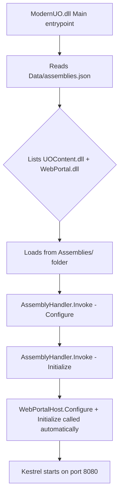
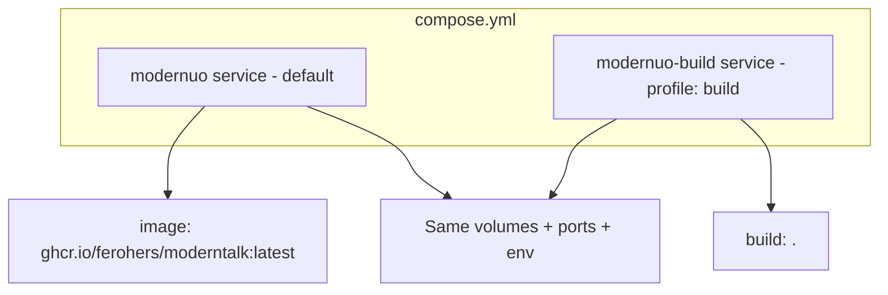

# Docker + WebPortal Integration Plan

## Problem Statement

The previous attempt to include the WebPortal project in the Docker image failed. The image was built successfully, but the WebPortal did not function at runtime. This plan addresses the root causes and provides a corrected Dockerfile and compose.yml.

---

## Root Cause Analysis

### Why the previous Dockerfile failed

The current [`Dockerfile`](Dockerfile:1) has several issues:

1. **Redundant separate WebPortal publish** — Lines 21-25 publish `WebPortal.csproj` separately to `/webportal-publish`, then line 46 manually copies just `WebPortal.dll`. This misses WebPortal's NuGet dependencies (JWT packages: `Microsoft.AspNetCore.Authentication.JwtBearer`, `System.IdentityModel.Tokens.Jwt`) which are not included when copying a single DLL.

2. **`dotnet publish` with `-r linux-x64` changes output structure** — When a RuntimeIdentifier is specified, the publish output goes to `Projects/Application/bin/Release/net10.0/linux-x64/publish/`, NOT to the `Distribution/` folder. The `<OutDir>` in the csproj is for build output, but publish uses a different directory.

3. **`COPY --from=build /src/Distribution .` copies the WRONG folder** — After `dotnet publish -r linux-x64`, the published runnable files are in the `bin/.../publish/` subdirectory, not in `Distribution/`. The `Distribution/` folder only has intermediate build output, not the complete publish output with all runtime DLLs.

4. **Missing Data files** — The `Distribution/Data/` source files (like `assemblies.json`) are repo source files, not build output. They may not be in the publish directory.

5. **`source-code/` directory bloats build context** — The `.dockerignore` does not exclude `source-code/`, sending ~100MB+ of unnecessary files as Docker build context.

### How ModernUO loads assemblies at runtime



Key files in the chain:
- [`Distribution/Data/assemblies.json`](Distribution/Data/assemblies.json:1) — Must list `WebPortal.dll`
- [`Projects/Application/Application.csproj`](Projects/Application/Application.csproj:33) — Must have `<ProjectReference>` to WebPortal and `<FrameworkReference>` to ASP.NET Core
- [`Projects/WebPortal/WebPortal.csproj`](Projects/WebPortal/WebPortal.csproj:1) — Must have `<OutDir>` pointing to `Distribution/Assemblies`
- [`Projects/WebPortal/WebPortalHost.cs`](Projects/WebPortal/WebPortalHost.cs:47) — Reads wwwroot from `Core.BaseDirectory/wwwroot`

---

## Solution

### New Dockerfile Strategy

Instead of the current two-publish approach, use a **single `dotnet publish` of Application.csproj** with an explicit output directory. This ensures all transitive dependencies (including WebPortal's JWT packages) are included.

```mermaid
graph LR
    subgraph Build Stage
        A[dotnet publish Application.csproj] --> B[/publish output]
        B --> C[All DLLs + deps.json + runtimeconfig]
        D[Distribution/Data/] --> E[Game data files]
        F[Projects/WebPortal/wwwroot/] --> G[Static web files]
    end
    subgraph Runtime Stage
        H[aspnet:10.0 base image]
        B --> I[/app/]
        E --> I
        G --> I
    end
```

#### Step-by-step Dockerfile logic

**Stage 1: Build**
1. Use `mcr.microsoft.com/dotnet/sdk:10.0`
2. Copy entire source tree (respects `.dockerignore`)
3. `dotnet publish Projects/Application/Application.csproj -c Release -r linux-x64 --self-contained=false -o /publish`
   - This single command builds ALL projects transitively: Server → Logger, Application → Server + UOContent + WebPortal
   - WebPortal's NuGet deps (JWT packages) flow through because Application.csproj has a normal `<ProjectReference>` to WebPortal (not `Private=false`)
   - Output includes: `ModernUO.dll`, `Assemblies/UOContent.dll`, `Assemblies/WebPortal.dll`, `Assemblies/Logger.dll`, all dependency DLLs, `.deps.json`, `.runtimeconfig.json`
4. Copy `Distribution/Data/` to `/publish/Data/` (game data files that are source, not build output)
5. Copy `Projects/WebPortal/wwwroot/` to `/publish/wwwroot/` (static web files, since the `CopyWwwroot` MSBuild target may not fire correctly during publish with `-r`)

**Stage 2: Runtime**
1. Use `mcr.microsoft.com/dotnet/aspnet:10.0` (needed for ASP.NET Core / Kestrel)
2. Install native dependencies: `libicu-dev`, `libdeflate-dev`, `zstd`, `libargon2-dev`, `liburing-dev`
3. Copy `/publish/` → `/app/`
4. Expose ports 2593 (game) and 8080 (web portal)
5. Entry point: `dotnet ModernUO.dll`

### Compose.yml Strategy

Two service definitions using Docker Compose profiles:

- **`modernuo`** (default) — Pulls pre-built image from GitHub Container Registry (`ghcr.io/ferohers/moderntalk:latest`)
- **`modernuo-build`** (profile: `build`) — Builds from local Dockerfile as fallback



Usage:
- `docker compose up` → uses pre-built GitHub image
- `docker compose --profile build up` → builds from local Dockerfile
- `docker compose --profile build build` → just builds the image

### .dockerignore Updates

Add `source-code/` to prevent sending the original source archive as build context.

---

## Files to Modify

| File | Change |
|------|--------|
| [`Dockerfile`](Dockerfile:1) | Complete rewrite: single publish, correct output copy, proper wwwroot handling |
| [`compose.yml`](compose.yml:1) | Add GitHub image as default + build profile as fallback |
| [`.dockerignore`](.dockerignore:1) | Add `source-code/` exclusion |

---

## Detailed File Specifications

### Dockerfile

```dockerfile
# -- Stage 1: Build --
FROM mcr.microsoft.com/dotnet/sdk:10.0 AS build
WORKDIR /src

# Copy everything (respects .dockerignore)
COPY . .

# Single publish of Application - builds ALL projects transitively
# including Server, UOContent, WebPortal, and Logger
# WebPortal's NuGet deps (JWT) flow through because it's a normal ProjectReference
RUN dotnet publish Projects/Application/Application.csproj \
    -c Release \
    -r linux-x64 \
    --self-contained=false \
    -o /publish

# Copy game data files (source files, not build output)
RUN cp -r Distribution/Data /publish/Data

# Copy wwwroot (the CopyWwwroot MSBuild target may not fire with -r flag)
RUN cp -r Projects/WebPortal/wwwroot /publish/wwwroot

# -- Stage 2: Runtime --
FROM mcr.microsoft.com/dotnet/aspnet:10.0

RUN apt-get update && apt-get install -y \
    libicu-dev \
    libdeflate-dev \
    zstd \
    libargon2-dev \
    liburing-dev \
    && rm -rf /var/lib/apt/lists/*

WORKDIR /app

COPY --from=build /publish .

EXPOSE 2593
EXPOSE 8080

ENTRYPOINT ["dotnet", "ModernUO.dll"]
```

### compose.yml

```yaml
services:
  # Default: uses pre-built image from GitHub Container Registry
  modernuo:
    image: ghcr.io/ferohers/moderntalk:latest
    container_name: modernuo_server
    restart: unless-stopped
    ports:
      - "2593:2593"    # Game server
      - "8080:8080"    # Web portal
    volumes:
      - /home/altan/modernuo/gamefiles:/gamefiles
      - ./configuration:/app/Configuration
      - ./shard:/app/Saves
    environment:
      - DOTNET_SYSTEM_GLOBALIZATION_INVARIANT=false
    cap_add:
      - SYS_NICE
      - IPC_LOCK
    security_opt:
      - seccomp:unconfined
    stdin_open: true
    tty: true

  # Fallback: build from local Dockerfile
  modernuo-build:
    profiles:
      - build
    build:
      context: .
      dockerfile: Dockerfile
    container_name: modernuo_server
    restart: unless-stopped
    ports:
      - "2593:2593"    # Game server
      - "8080:8080"    # Web portal
    volumes:
      - /home/altan/modernuo/gamefiles:/gamefiles
      - ./configuration:/app/Configuration
      - ./shard:/app/Saves
    environment:
      - DOTNET_SYSTEM_GLOBALIZATION_INVARIANT=false
    cap_add:
      - SYS_NICE
      - IPC_LOCK
    security_opt:
      - seccomp:unconfined
    stdin_open: true
    tty: true
```

### .dockerignore addition

```
# Original source code archive (not needed for build)
source-code/
```

---

## Verification Checklist

After building and running, verify:

1. **Container starts** — `docker compose --profile build up` shows ModernUO console output
2. **WebPortal loads** — Log line: `Web Portal configured on port 8080`
3. **Game server listens** — Port 2593 accepts UO client connections
4. **Web portal serves** — `curl http://localhost:8080` returns HTML
5. **API works** — `curl http://localhost:8080/api/server/info` returns JSON
6. **Assemblies loaded** — No `FileNotFoundException` for WebPortal.dll in logs
7. **wwwroot served** — Static files (CSS, JS, images) load correctly
8. **JWT dependencies present** — No `MissingMethodException` or `FileNotFoundException` for JWT packages

---

## Key Differences from Previous Attempt

| Aspect | Previous (Failed) | New (This Plan) |
|--------|-------------------|------------------|
| WebPortal publish | Separate `dotnet publish` + manual DLL copy | Single publish via Application project reference |
| JWT NuGet packages | Missing from runtime image | Included transitively via ProjectReference |
| Output directory | `COPY /src/Distribution .` (wrong dir) | `COPY /publish .` (explicit output dir) |
| wwwroot | Copied from source separately | Copied from source as explicit step |
| Data files | Relied on being in Distribution | Explicitly copied from Distribution/Data |
| Build context | Includes source-code/ | Excluded via .dockerignore |
| Compose | Build-only | GitHub image default + build fallback |
