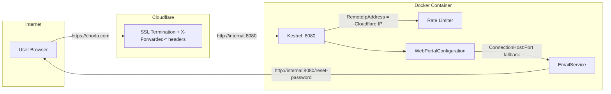
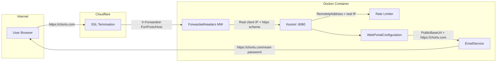

# Reverse Proxy Support Fix — Plan

## Problem Statement

The Web Portal runs behind a Cloudflare reverse proxy (SSL termination), but the codebase has **3 interconnected issues** that break functionality in this deployment:

1. **Password reset emails contain internal addresses and ports** — e.g. `http://192.168.1.100:8080/reset-password.html?token=...` instead of `https://chorlu.com/reset-password.html?token=...`
2. **Rate limiting sees Cloudflare IPs, not real client IPs** — all users share one rate limit bucket because `RemoteIpAddress` returns a Cloudflare edge IP
3. **No unified public URL concept** — `PasswordResetBaseUrl`, `ConnectionHost`, and `Port` have overlapping/conflicting purposes

---

## Current Architecture — What's Broken



### Root Causes in Code

| Issue | File | Line | Problem |
|-------|------|------|---------|
| Internal URL in emails | [`EmailService.cs`](Projects/WebPortal/Services/EmailService.cs:26) | 26-31 | Falls back to `http://{ConnectionHost}:{Port}` — exposes internal IP and port |
| No forwarded headers | [`WebPortalHost.cs`](Projects/WebPortal/WebPortalHost.cs:55) | 55 | Kestrel has no `UseForwardedHeaders()` — ignores `X-Forwarded-*` headers |
| Rate limiter sees proxy IP | [`RateLimitingMiddleware.cs`](Projects/WebPortal/Middleware/RateLimitingMiddleware.cs:97) | 97-102 | `GetClientIp` uses `RemoteIpAddress` which is Cloudflare, not the real client |
| Scattered URL config | [`WebPortalConfiguration.cs`](Projects/WebPortal/Configuration/WebPortalConfiguration.cs:32) | 32 | `PasswordResetBaseUrl` is separate from `ConnectionHost` with no unified concept |

---

## Proposed Architecture



---

## Detailed Changes

### 1. Add `PublicBaseUrl` and `BehindReverseProxy` to Configuration

**File:** [`WebPortalConfiguration.cs`](Projects/WebPortal/Configuration/WebPortalConfiguration.cs)

**Changes:**
- Add `PublicBaseUrl` property — the public-facing URL where users reach the portal (e.g. `https://chorlu.com`)
- Add `BehindReverseProxy` property — boolean flag to enable forwarded headers processing
- Keep `PasswordResetBaseUrl` for backward compatibility but read it as a fallback for `PublicBaseUrl`
- Remove the `PasswordResetBaseUrl` property (replace with `PublicBaseUrl` that falls back to the old config key)

```csharp
// New properties
public static string PublicBaseUrl { get; private set; } = "";
public static bool BehindReverseProxy { get; private set; }

// In Configure():
PublicBaseUrl = ServerConfiguration.GetOrUpdateSetting("webPortal.publicBaseUrl", "");

// Backward compatibility: fall back to old config key
if (string.IsNullOrWhiteSpace(PublicBaseUrl))
{
    PublicBaseUrl = ServerConfiguration.GetOrUpdateSetting("webPortal.passwordResetBaseUrl", "");
}

BehindReverseProxy = ServerConfiguration.GetOrUpdateSetting("webPortal.behindReverseProxy", false);
```

**Config example in `modernuo.json`:**
```json
{
  "webPortal": {
    "publicBaseUrl": "https://chorlu.com",
    "behindReverseProxy": true,
    "port": 8080,
    "connectionHost": "chorlu.com",
    "connectionPort": 2593
  }
}
```

**Key design decision:** `PublicBaseUrl` is a single, complete URL (scheme + host, no path). It is used for:
- Password reset email links
- Any future user-facing URL construction (email verification, invitations, etc.)

`ConnectionHost` + `ConnectionPort` remain **only** for game client connection info (UO client connect address).

---

### 2. Add ForwardedHeaders Middleware

**File:** [`WebPortalHost.cs`](Projects/WebPortal/WebPortalHost.cs)

**Changes:**
- Add `ForwardedHeaders` middleware before other middleware
- Configure it to process `X-Forwarded-For`, `X-Forwarded-Proto`, and `X-Forwarded-Host`
- Only active when `BehindReverseProxy` is `true`

```csharp
// After builder.Build(), BEFORE other middleware
if (WebPortalConfiguration.BehindReverseProxy)
{
    builder.Services.Configure<ForwardedHeadersOptions>(options =>
    {
        options.ForwardedHeaders = ForwardedHeaders.XForwardedFor 
            | ForwardedHeaders.XForwardedProto 
            | ForwardedHeaders.XForwardedHost;
        // Trust all proxies — Cloudflare IPs change frequently
        // Security is maintained because Cloudflare overwrites these headers
        options.KnownNetworks.Clear();
        options.KnownProxies.Clear();
    });

    app.UseForwardedHeaders();
}
```

**Important:** This must be placed BEFORE `SecurityHeadersMiddleware` and `RateLimitingMiddleware` so that the real client IP is available when rate limiting runs.

**Security note:** We clear `KnownNetworks` and `KnownProxies` to trust all proxies. This is safe because:
- Cloudflare always overwrites `X-Forwarded-*` headers (doesn't pass through client-supplied values)
- The server is not directly exposed to the internet — Cloudflare is the only entry point
- If someone accesses the server directly bypassing Cloudflare, they could spoof headers, but that requires knowing the internal IP:port

---

### 3. Update EmailService to Use PublicBaseUrl

**File:** [`EmailService.cs`](Projects/WebPortal/Services/EmailService.cs)

**Changes:**
- Replace `PasswordResetBaseUrl` with `PublicBaseUrl`
- Remove the `ConnectionHost:Port` fallback entirely — it's never correct for reverse proxy setups
- Add a startup warning if `PublicBaseUrl` is empty when SMTP is enabled

```csharp
public async Task<bool> SendPasswordResetEmail(string toEmail, string username, string resetToken)
{
    if (!IsConfigured)
    {
        logger.Warning("Web Portal: Cannot send password reset email — SMTP is not configured");
        return false;
    }

    var baseUrl = WebPortalConfiguration.PublicBaseUrl;
    if (string.IsNullOrWhiteSpace(baseUrl))
    {
        logger.Warning("Web Portal: Cannot send password reset email — webPortal.publicBaseUrl is not configured");
        return false;
    }

    var resetUrl = $"{baseUrl.TrimEnd('/')}/reset-password.html?token={Uri.EscapeDataString(resetToken)}";
    // ... rest unchanged
}
```

**Before vs After:**

| Scenario | Before | After |
|----------|--------|-------|
| `publicBaseUrl` = `https://chorlu.com` | N/A | `https://chorlu.com/reset-password.html?token=...` ✓ |
| `passwordResetBaseUrl` = `https://chorlu.com` (old config) | `https://chorlu.com/reset-password.html?token=...` ✓ | Falls back to old key → `https://chorlu.com/reset-password.html?token=...` ✓ |
| Neither configured | `http://192.168.1.100:8080/reset-password.html?token=...` ✗ | Logs warning, returns false ✗ (safe failure) |

---

### 4. Update RateLimitingMiddleware to Use Real Client IPs

**File:** [`RateLimitingMiddleware.cs`](Projects/WebPortal/Middleware/RateLimitingMiddleware.cs)

**Changes:**
- After `UseForwardedHeaders()` is active, `HttpContext.Connection.RemoteIpAddress` automatically contains the real client IP
- Update `GetClientIp` to also check `X-Forwarded-For` as a belt-and-suspenders approach
- Add `X-Real-IP` support (some proxies use this instead)

```csharp
private static string GetClientIp(HttpContext context)
{
    // When ForwardedHeaders middleware is active, RemoteIpAddress is already the real client IP
    var remoteIp = context.Connection.RemoteIpAddress?.ToString();
    if (remoteIp != null && !IsPrivateOrProxyIp(remoteIp))
    {
        return remoteIp;
    }

    // Fallback: check X-Forwarded-For header manually
    var forwardedFor = context.Request.Headers["X-Forwarded-For"].FirstOrDefault();
    if (!string.IsNullOrWhiteSpace(forwardedFor))
    {
        // X-Forwarded-For: client, proxy1, proxy2 — first entry is the real client
        var firstIp = forwardedFor.Split(',')[0].Trim();
        if (!string.IsNullOrWhiteSpace(firstIp))
        {
            return firstIp;
        }
    }

    // Fallback: check X-Real-IP header
    var realIp = context.Request.Headers["X-Real-IP"].FirstOrDefault();
    if (!string.IsNullOrWhiteSpace(realIp))
    {
        return realIp.Trim();
    }

    return remoteIp ?? "unknown";
}

private static bool IsPrivateOrProxyIp(string ip)
{
    // Simple check for common private/proxy ranges
    return ip.StartsWith("10.") 
        || ip.StartsWith("172.16.") 
        || ip.StartsWith("192.168.") 
        || ip == "127.0.0.1"
        || ip == "::1";
}
```

**Note:** When `BehindReverseProxy` is `true` and `UseForwardedHeaders()` is active, the primary path (`RemoteIpAddress` is already real) will be taken. The header checks are defensive fallbacks.

---

### 5. Add Startup Validation

**File:** [`WebPortalConfiguration.cs`](Projects/WebPortal/Configuration/WebPortalConfiguration.cs)

**Changes:**
- After loading all config, validate and warn about misconfigurations

```csharp
// Validation warnings
if (SmtpEnabled && string.IsNullOrWhiteSpace(PublicBaseUrl))
{
    logger.Warning("Web Portal: SMTP is enabled but webPortal.publicBaseUrl is not set. Password reset emails will contain invalid links.");
}

if (BehindReverseProxy && string.IsNullOrWhiteSpace(PublicBaseUrl))
{
    logger.Warning("Web Portal: behindReverseProxy is enabled but webPortal.publicBaseUrl is not set. Some features may not work correctly.");
}
```

---

### 6. Ensure ServerEndpoints Uses ConnectionHost Only for Game Info

**File:** [`ServerEndpoints.cs`](Projects/WebPortal/Endpoints/ServerEndpoints.cs)

**Current behavior is correct** — `ConnectionHost` and `ConnectionPort` are used to tell the UO game client how to connect to the game server. This is separate from the web portal URL and should NOT change.

No changes needed here, but adding a code comment for clarity:

```csharp
// ConnectionHost/Port are for the UO game client connection, NOT the web portal URL
var connectionHost = ServerList.PublicAddress?.ToString() ?? WebPortalConfiguration.ConnectionHost;
```

---

## Configuration Reference

### New Settings

| Setting | Key | Type | Default | Description |
|---------|-----|------|---------|-------------|
| `PublicBaseUrl` | `webPortal.publicBaseUrl` | string | `""` | Public URL where users reach the web portal (e.g. `https://chorlu.com`). Used for email links and any user-facing URL construction. |
| `BehindReverseProxy` | `webPortal.behindReverseProxy` | bool | `false` | Set to `true` when running behind Cloudflare, nginx, or any reverse proxy. Enables ForwardedHeaders processing for correct client IPs and scheme detection. |

### Backward Compatibility

| Old Setting | New Setting | Migration |
|-------------|-------------|-----------|
| `webPortal.passwordResetBaseUrl` | `webPortal.publicBaseUrl` | Old key is read as fallback if new key is not set |

### Example Configuration

```json
{
  "webPortal": {
    "enabled": true,
    "port": 8080,
    "publicBaseUrl": "https://chorlu.com",
    "behindReverseProxy": true,
    "connectionHost": "chorlu.com",
    "connectionPort": 2593,
    "smtp": {
      "enabled": true,
      "host": "smtp.example.com",
      "port": 587,
      "useSsl": true,
      "fromAddress": "noreply@chorlu.com",
      "fromName": "Chorlu UO"
    }
  }
}
```

---

## Files to Modify

| File | Change |
|------|--------|
| [`WebPortalConfiguration.cs`](Projects/WebPortal/Configuration/WebPortalConfiguration.cs) | Add `PublicBaseUrl`, `BehindReverseProxy` properties; add backward-compat fallback; add validation warnings |
| [`WebPortalHost.cs`](Projects/WebPortal/WebPortalHost.cs) | Add `ForwardedHeaders` middleware when `BehindReverseProxy` is true; register `ForwardedHeadersOptions` |
| [`EmailService.cs`](Projects/WebPortal/Services/EmailService.cs) | Use `PublicBaseUrl` instead of `PasswordResetBaseUrl`; remove `ConnectionHost:Port` fallback; fail safely with warning |
| [`RateLimitingMiddleware.cs`](Projects/WebPortal/Middleware/RateLimitingMiddleware.cs) | Update `GetClientIp` to handle forwarded headers and proxy IPs |

---

## Out of Scope

- **Cookie Secure/SameSite adjustments** — Cloudflare handles SSL, but the cookies are already set with `Secure = false` which works behind the proxy. A future improvement could set `Secure = true` when `BehindReverseProxy` is true, but this requires testing with Cloudflare's cookie handling.
- **HSTS headers** — Cloudflare handles HSTS at the edge. No need to add it in Kestrel.
- **WebSocket proxy configuration** — Not currently used by the web portal.
