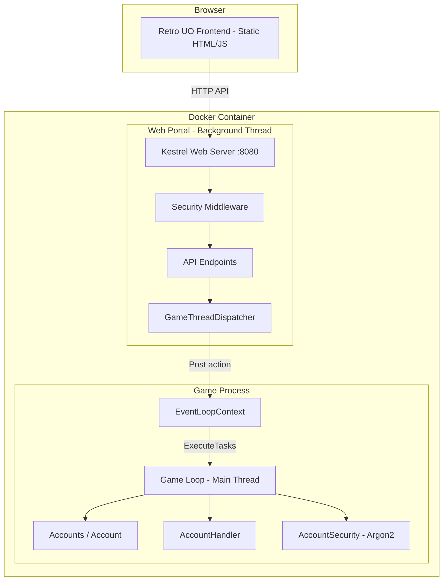
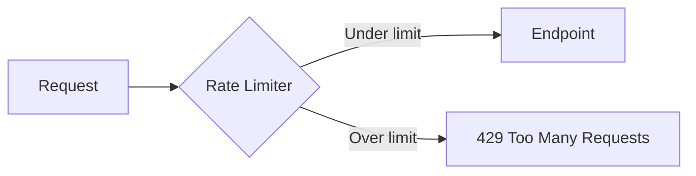
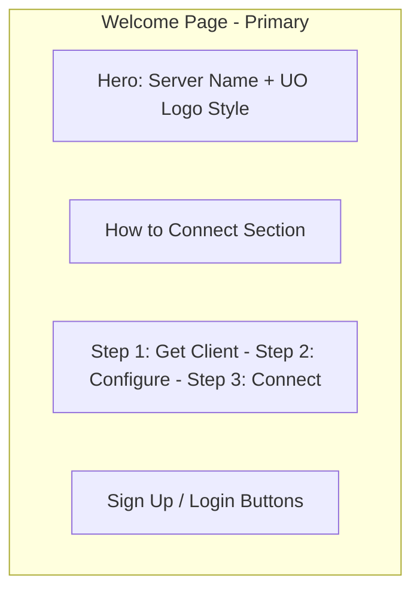

# ModernUO Web Portal - Architecture Plan

## Overview

A web portal for ModernUO server that allows users to create accounts, view account information, change passwords, and learn how to connect to the server. The design follows a retro Ultima Online aesthetic with modern web security practices.

---

## Architecture

### High-Level Design



### Key Architectural Decision: Thread Safety

ModernUO is **single-threaded** — all game logic runs on one thread. The web server runs on Kestrel's thread pool. To safely access game state, all operations must be dispatched to the game thread via [`EventLoopContext.Post()`](Projects/Server/EventLoopTasks.cs:45).

The [`GameThreadDispatcher`](#game-thread-dispatcher) service encapsulates this pattern:

```csharp
public static Task<T> Enqueue<T>(Func<T> action)
{
    var tcs = new TaskCompletionSource<T>();
    Core.LoopContext.Post(() =>
    {
        try { tcs.SetResult(action()); }
        catch (Exception ex) { tcs.SetException(ex); }
    });
    return tcs.Task;
}
```

This ensures:
- No concurrent access to game state
- No locks needed in game code
- Web requests await safely while game thread processes the action

---

## Project Structure

```
Projects/WebPortal/
├── WebPortal.csproj
├── WebPortalHost.cs              -- Static Configure/Initialize for server integration
├── Configuration/
│   └── WebPortalConfiguration.cs -- Reads settings from modernuo.json
├── Services/
│   ├── GameThreadDispatcher.cs   -- Dispatches work to game thread
│   ├── AuthService.cs            -- Login, register, token management
│   ├── AccountService.cs         -- Account info, password change
│   └── TokenService.cs           -- JWT generation and validation
├── Middleware/
│   ├── RateLimitingMiddleware.cs -- Per-IP rate limiting
│   ├── SecurityHeadersMiddleware.cs
│   └── AccountLockoutService.cs  -- Tracks failed login attempts
├── Endpoints/
│   ├── AuthEndpoints.cs          -- POST /api/auth/register, login, refresh, logout
│   ├── AccountEndpoints.cs       -- GET /api/account/info, POST /api/account/change-password
│   └── ServerEndpoints.cs        -- GET /api/server/info
├── Models/
│   ├── Requests.cs               -- LoginRequest, RegisterRequest, ChangePasswordRequest
│   └── Responses.cs              -- AccountInfoResponse, ServerInfoResponse, AuthResponse
└── wwwroot/
    ├── index.html                -- Welcome / How to Connect page - PRIMARY
    ├── login.html                -- Login page
    ├── register.html             -- Sign up page
    ├── dashboard.html            -- Account dashboard
    ├── css/
    │   └── uo-theme.css          -- Retro UO theme stylesheet
    └── js/
        └── app.js                -- Frontend API calls and UI logic
```

---

## API Endpoints

### Public Endpoints - No Auth Required

| Method | Path | Description |
|--------|------|-------------|
| GET | `/api/server/info` | Server name, status, connection info, player count |
| POST | `/api/auth/register` | Create a new account |
| POST | `/api/auth/login` | Login and receive JWT tokens |
| POST | `/api/auth/refresh` | Refresh an expired access token |

### Authenticated Endpoints - JWT Required

| Method | Path | Description |
|--------|------|-------------|
| GET | `/api/account/info` | Account status, created date, last login, characters |
| POST | `/api/account/change-password` | Change account password |
| POST | `/api/auth/logout` | Invalidate refresh token |

### Request/Response Models

```
RegisterRequest:
  username: string (3-30 chars, no forbidden chars)
  password: string (8-128 chars)
  email: string (optional)

LoginRequest:
  username: string
  password: string

ChangePasswordRequest:
  currentPassword: string
  newPassword: string (8-128 chars)

AccountInfoResponse:
  username: string
  email: string
  accessLevel: string
  banned: boolean
  created: datetime
  lastLogin: datetime
  characterCount: int
  maxCharacters: int

ServerInfoResponse:
  serverName: string
  online: boolean
  playerCount: int
  clientVersion: string
  expansion: string
  connectionHost: string
  connectionPort: int

AuthResponse:
  accessToken: string
  refreshToken: string
  expiresIn: number (seconds)
```

---

## Security Design

### 1. Rate Limiting



- **Auth endpoints**: 5 requests per minute per IP
- **General API**: 60 requests per minute per IP
- **Account creation**: 3 per hour per IP
- Uses in-memory sliding window counter
- Returns `Retry-After` header on limit exceeded

### 2. Account Lockout

- After 5 failed login attempts, account is temporarily locked for 15 minutes
- Lockout counter resets on successful login
- Tracked in-memory per account username
- Progressive backoff: 5 fails = 15 min, 10 fails = 1 hour, 15 fails = 24 hours

### 3. Input Validation

- Reuse [`AccountHandler.IsValidUsername()`](Projects/UOContent/Accounting/AccountHandler.cs:246) logic server-side
- Password minimum 8 characters
- Username 3-30 characters, no forbidden chars `<>:\"/\\|?*`
- No leading/trailing spaces, no trailing period
- All inputs sanitized and length-capped
- Email validation with basic format check

### 4. JWT Authentication

- **Access token**: 15-minute expiry, stored in HttpOnly Secure SameSite=Strict cookie
- **Refresh token**: 7-day expiry, stored in HttpOnly Secure SameSite=Strict cookie, random 256-bit token
- Refresh tokens tracked in-memory with association to username
- On logout, refresh token is invalidated
- JWT claims: `sub` = username, `exp`, `iat`, `jti`

### 5. Security Headers

```
Content-Security-Policy: default-src 'self'; style-src 'self' 'unsafe-inline'; script-src 'self'
X-Content-Type-Options: nosniff
X-Frame-Options: DENY
Referrer-Policy: strict-origin-when-cross-origin
Permissions-Policy: camera=(), microphone=(), geolocation=()
```

### 6. Password Security

- Uses existing [`Account.SetPassword()`](Projects/UOContent/Accounting/Account.cs:382) which uses Argon2
- Uses existing [`Account.CheckPassword()`](Projects/UOContent/Accounting/Account.cs:392) for validation
- Passwords never logged or exposed in API responses
- New passwords must differ from current password

### 7. Anti-Enumeration

- Login failures return generic "Invalid credentials" message
- Registration of existing username returns generic error
- No indication whether username exists

---

## Frontend Design

### Theme: Retro UO Aesthetic

The frontend uses a dark medieval fantasy theme inspired by the Ultima Online client UI:

- **Background**: Dark stone texture via CSS gradients - `#0C0A08` to `#1A1510`
- **Primary accent**: Gold/amber - `#C8A848` 
- **Secondary accent**: Parchment - `#D4C4A0`
- **Text**: Light parchment - `#E8DCC8` on dark backgrounds
- **Borders**: Ornate gold borders with inset shadow effects
- **Fonts**: 
  - Headings: `Cinzel` - serif medieval font
  - Body: `Crimson Text` - readable serif
- **Buttons**: Stone-textured with gold hover, beveled edges
- **Input fields**: Dark recessed with gold border on focus
- **Frames**: UO-style ornate border frames using CSS box-shadow layering

### Page Layout



#### Welcome Page - `/` (Primary)

The main landing page focuses on **how to connect** to the server:

1. **Hero Section**: Server name in medieval font, tagline
2. **How to Connect** - Step-by-step guide:
   - Step 1: Download and install a compatible UO client (link to CUO/Razor)
   - Step 2: Configure server address: `yourserver.com:2593`
   - Step 3: Create an account using the Sign Up button below
   - Step 4: Log in and play!
3. **Server Status**: Online/offline indicator, player count
4. **Call to Action**: Sign Up / Login buttons

#### Sign Up Page - `/register.html` (Secondary)

- Username field with validation hints
- Password field with strength indicator
- Confirm password field
- Optional email field
- Link back to login

#### Login Page - `/login.html` (Secondary)

- Username field
- Password field
- Remember me checkbox
- Link to sign up

#### Account Dashboard - `/dashboard.html` (Protected)

- Account status badge: Active / Banned
- Username display
- Account created date
- Last login date
- Character count: X / 7
- Change password form
- Logout button

---

## Server Integration

### How WebPortal Starts

The WebPortal follows the same initialization pattern as other ModernUO systems:

```csharp
namespace Server.WebPortal;

public static class WebPortalHost
{
    private static WebApplication _app;

    public static void Configure()
    {
        // Read settings from ServerConfiguration
        WebPortalConfiguration.Configure();
    }

    public static void Initialize()
    {
        // Start Kestrel on a background thread
        Task.Run(StartWebServer);
    }

    private static async Task StartWebServer()
    {
        var builder = WebApplication.CreateBuilder();
        // ... configure services
        _app = builder.Build();
        // ... configure middleware and endpoints
        await _app.RunAsync($"http://0.0.0.0:{WebPortalConfiguration.Port}");
    }
}
```

The server's assembly scanner discovers `Configure()` and `Initialize()` automatically, just like [`AccountHandler`](Projects/UOContent/Accounting/AccountHandler.cs:16).

### Configuration in modernuo.json

New settings added to the existing configuration file:

```json
{
  "settings": {
    "webPortal.enabled": "true",
    "webPortal.port": "8080",
    "webPortal.jwtSecret": "<auto-generated-256-bit-key>",
    "webPortal.maxLoginAttemptsPerMinute": "5",
    "webPortal.accountLockoutMinutes": "15",
    "webPortal.accessTokenExpiryMinutes": "15",
    "webPortal.refreshTokenExpiryDays": "7"
  }
}
```

---

## Docker Integration

### Updated compose.yml

```yaml
services:
  modernuo:
    build:
      context: .
      dockerfile: Dockerfile
    container_name: modernuo_server
    restart: unless-stopped
    ports:
      - "2593:2593"    # Game server
      - "8080:8080"    # Web portal
    volumes:
      - ./gamefiles:/gamefiles
      - ./configuration:/app/Configuration
      - ./shard:/app/Saves
    environment:
      - DOTNET_SYSTEM_GLOBALIZATION_INVARIANT=false
    cap_add:
      - SYS_NICE
      - IPC_LOCK
    security_opt:
      - seccomp:unconfined
    stdin_open: true
    tty: true
```

---

## Implementation Order

1. **Create `Projects/WebPortal/WebPortal.csproj`** - ASP.NET Core class library with framework reference
2. **Implement `GameThreadDispatcher`** - Core dispatch mechanism for thread safety
3. **Implement `WebPortalConfiguration`** - Read settings from ServerConfiguration
4. **Implement `TokenService`** - JWT generation and validation
5. **Implement `AccountLockoutService`** - Failed attempt tracking
6. **Implement `AuthService`** - Register, login, logout, refresh logic
7. **Implement `AccountService`** - Account info, password change
8. **Implement Security Middleware** - Rate limiting, security headers
9. **Implement API Endpoints** - Wire up all routes
10. **Implement `WebPortalHost`** - Configure/Initialize for server integration
11. **Build frontend HTML/CSS** - Retro UO theme pages
12. **Build frontend JS** - API integration and UI logic
13. **Update `Application.csproj`** - Add WebPortal project reference
14. **Update Docker compose** - Add port 8080 mapping
15. **Test end-to-end** - Register, login, view account, change password

---

## Dependencies

The WebPortal project requires these NuGet packages:

- `Microsoft.AspNetCore.App` (framework reference)
- `System.IdentityModel.Tokens.Jwt` - JWT token handling
- `Microsoft.AspNetCore.Authentication.JwtBearer` - JWT auth middleware

No additional game dependencies beyond what Server and UOContent already provide.

---

## Security Checklist

- [x] All game state access dispatched to main thread via EventLoopContext
- [x] Argon2 password hashing via existing Account.SetPassword/CheckPassword
- [x] JWT with short-lived access tokens in HttpOnly cookies
- [x] Per-IP rate limiting on all endpoints
- [x] Account lockout after failed login attempts
- [x] Input validation matching AccountHandler rules
- [x] Security headers on all responses
- [x] No password exposure in logs or API responses
- [x] Anti-enumeration: generic error messages for auth failures
- [x] CORS restricted to same-origin
- [x] No SQL injection possible - no database, uses in-memory game objects
- [x] No XSS possible - CSP headers, no user HTML rendering
- [x] Refresh token rotation on use
