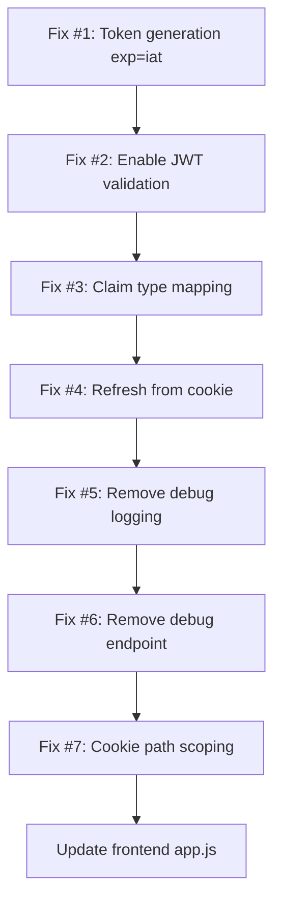

# Web Portal Security Fix Plan

## Executive Summary

The Web Portal has **one critical functional bug** (tokens expire instantly causing 401s) and **one critical security vulnerability** (JWT validation is completely disabled, allowing any user to impersonate any other user). There are also several secondary bugs and security concerns.

---

## Bug #1: JWT `exp` = `iat` — Tokens Expire Instantly (ROOT CAUSE OF 401)

### Evidence

Decoding the access token from the curl output:

```json
{
  "sub": "altan",
  "jti": "a7e3473f-4fc9-4f93-9fde-044adfd4407d",
  "iat": 1775832322,
  "nbf": 1775832322,
  "exp": 1775832322,   // <-- SAME AS iat! Token is already expired
  "iss": "ModernUO",
  "aud": "ModernUO-WebPortal"
}
```

The API response says `expiresIn: 900` (15 minutes), but the actual JWT has `exp = iat`. The token expires the exact second it was created.

### Root Cause

In [`TokenService.cs:35-46`](Projects/WebPortal/Services/TokenService.cs:35), the code uses `SecurityTokenDescriptor` with `Expires` property. In `System.IdentityModel.Tokens.Jwt` v8.11.0, there was a breaking change where `SecurityTokenDescriptor.Expires` may be ignored in favor of the newer `JwtSecurityTokenDescriptor` API. The `CreateToken()` method no longer reliably reads `Expires` from the base descriptor.

### Fix

Replace the `SecurityTokenDescriptor` + `CreateToken()` pattern with explicit `JwtSecurityToken` construction:

```csharp
var token = new JwtSecurityToken(
    issuer: "ModernUO",
    audience: "ModernUO-WebPortal",
    claims: claims,
    notBefore: now,
    expires: expiresAt,
    signingCredentials: _signingCredentials
);
var accessToken = handler.WriteToken(token);
```

This directly sets `expires` on the JWT payload and is guaranteed to work across library versions.

---

## Bug #2: JWT Validation Completely Disabled — CRITICAL SECURITY VULNERABILITY

### Evidence

In [`WebPortalHost.cs:72-83`](Projects/WebPortal/WebPortalHost.cs:72):

```csharp
options.TokenValidationParameters = new TokenValidationParameters
{
    ValidateIssuerSigningKey = false,   // Signing key NOT validated
    IssuerSigningKey = new SymmetricSecurityKey(key),
    ValidateIssuer = false,             // Any issuer accepted
    ValidIssuer = "ModernUO",
    ValidateAudience = false,           // Any audience accepted
    ValidAudience = "ModernUO-WebPortal",
    ValidateLifetime = false,           // Expired tokens accepted
    ClockSkew = TimeSpan.FromMinutes(1),
    RequireSignedTokens = false         // UNSIGNED TOKENS ACCEPTED!
};
```

### Impact

With `RequireSignedTokens = false` and `ValidateIssuerSigningKey = false`, an attacker can:

1. Craft a JWT with any `sub` claim (e.g., an admin username)
2. Leave it unsigned or sign it with any key
3. The server will accept it as valid

**This is how users can change other users data.** Anyone can impersonate anyone.

### Fix

Enable ALL validation flags:

```csharp
options.TokenValidationParameters = new TokenValidationParameters
{
    ValidateIssuerSigningKey = true,
    IssuerSigningKey = new SymmetricSecurityKey(key),
    ValidateIssuer = true,
    ValidIssuer = "ModernUO",
    ValidateAudience = true,
    ValidAudience = "ModernUO-WebPortal",
    ValidateLifetime = true,
    ClockSkew = TimeSpan.FromMinutes(1),
    RequireSignedTokens = true,
    NameClaimType = JwtRegisteredClaimNames.Sub
};
```

---

## Bug #3: Claim Type Mapping — `context.User.Identity.Name` Returns Null

### Evidence

In [`AccountEndpoints.cs:17-18`](Projects/WebPortal/Endpoints/AccountEndpoints.cs:17):

```csharp
var username = context.User?.Identity?.Name ??
              context.User.FindFirst(JwtRegisteredClaimNames.Sub)?.Value;
```

The JWT handler maps `sub` to `ClaimTypes.NameIdentifier` (a long URI) by default. So:
- `Identity.Name` looks for `ClaimTypes.Name` → not found → null
- `FindFirst(JwtRegisteredClaimNames.Sub)` looks for `"sub"` → not found → null (because it was mapped to the URI)

The fallback chain returns null, and the endpoint returns 401.

### Fix

Two changes needed:

1. Set `NameClaimType` in `TokenValidationParameters` (already included in Bug #2 fix)
2. Disable inbound claim mapping so `sub` stays as `sub`:

```csharp
options.TokenHandlers.Clear();
options.TokenHandlers.Add(new JwtSecurityTokenHandler { MapInboundClaims = false });
```

Then endpoints can simply use:

```csharp
var username = context.User.Identity?.Name;
```

---

## Bug #4: Refresh Endpoint Reads Token From Body Instead of Cookie

### Evidence

In [`AuthEndpoints.cs:63-65`](Projects/WebPortal/Endpoints/AuthEndpoints.cs:63):

```csharp
group.MapPost("/refresh", async (RefreshRequest request, AuthService authService, ...) =>
{
    var (username, error) = authService.RefreshToken(request.RefreshToken);
```

The frontend in [`app.js:98-103`](Projects/WebPortal/wwwroot/js/app.js:98) sends:

```javascript
body: JSON.stringify({ refreshToken: '' }) // Cookie-based - sends EMPTY string
```

The refresh token is stored in an HttpOnly cookie (`refresh_token`), but the endpoint reads from the request body which is empty.

### Fix

Read the refresh token from the cookie:

```csharp
group.MapPost("/refresh", async (HttpContext context, AuthService authService, TokenService tokenService, HttpResponse response) =>
{
    var refreshToken = context.Request.Cookies["refresh_token"];
    if (string.IsNullOrEmpty(refreshToken))
    {
        return Results.Unauthorized();
    }

    var (username, error) = authService.RefreshToken(refreshToken);
    // ... rest of handler
});
```

---

## Bug #5: Debug Logging Leaks Token Fragments

### Evidence

In [`WebPortalHost.cs:99-101`](Projects/WebPortal/WebPortalHost.cs:99):

```csharp
Console.WriteLine($"[JWT OnMessageReceived] Cookie: {context.Request.Cookies["access_token"]?.Substring(0, Math.Min(30, ...))}...");
Console.WriteLine($"[JWT OnMessageReceived] Header: {context.Request.Headers["Authorization"]}");
Console.WriteLine($"[JWT OnMessageReceived] Token set: {!string.IsNullOrEmpty(token)}");
```

Also lines 112-125 log full exception details including stack traces on every failed auth attempt.

### Fix

Remove all `Console.WriteLine` debug statements from the JWT event handlers. Replace with proper structured logging if needed, but never log token values.

---

## Bug #6: Debug Endpoint Exposes Auth Internals

### Evidence

In [`WebPortalHost.cs:152-168`](Projects/WebPortal/WebPortalHost.cs:152):

```csharp
app.MapGet("/debug/jwt", async (HttpContext ctx) =>
{
    var cookie = ctx.Request.Cookies["access_token"];
    var authHeader = ctx.Request.Headers["Authorization"].ToString();
    var claims = identity?.Claims.Select(c => $"{c.Type}={c.Value}").ToArray();
    return Results.Ok(new { CookieLength, HasAuthHeader, AuthHeader, UserIdentity, IsAuthenticated, Claims });
}).RequireAuthorization();
```

This endpoint exposes cookie lengths, auth headers, and all claims to any authenticated user.

### Fix

Remove the `/debug/jwt` endpoint entirely. It should never be in production code.

---

## Bug #7: Cookie SameSite and Path Configuration

### Current State

In [`AuthEndpoints.cs:113-130`](Projects/WebPortal/Endpoints/AuthEndpoints.cs:113):

- `SameSite = SameSiteMode.Lax` — acceptable for this use case
- `Path = "/"` — cookies sent on every request to any path
- `Secure = false` — required since Kestrel runs HTTP (no HTTPS)

### Recommended Improvements

1. **Scope the access_token cookie path to `/api/`** — the access token is only needed for API calls, not static files
2. **Keep refresh_token on `/`** — needed for the refresh endpoint
3. **Add `HttpOnly`** — already set, good

```csharp
// Access token - scope to /api/ path
response.Cookies.Append("access_token", authResponse.AccessToken, new CookieOptions
{
    HttpOnly = true,
    Secure = secure,
    SameSite = SameSiteMode.Lax,
    Path = "/api/",
    MaxAge = TimeSpan.FromSeconds(authResponse.ExpiresIn)
});
```

---

## Implementation Order

The fixes should be applied in this specific order because some depend on others:



### Files to Modify

| File | Changes |
|------|---------|
| [`TokenService.cs`](Projects/WebPortal/Services/TokenService.cs) | Replace SecurityTokenDescriptor with JwtSecurityToken constructor |
| [`WebPortalHost.cs`](Projects/WebPortal/WebPortalHost.cs) | Enable all JWT validation, add NameClaimType, disable MapInboundClaims, remove debug logging, remove debug endpoint |
| [`AuthEndpoints.cs`](Projects/WebPortal/Endpoints/AuthEndpoints.cs) | Read refresh token from cookie, scope cookie paths |
| [`AccountEndpoints.cs`](Projects/WebPortal/Endpoints/AccountEndpoints.cs) | Simplify username extraction after claim mapping fix |
| [`app.js`](Projects/WebPortal/wwwroot/js/app.js) | Remove empty refreshToken from refresh request body |

### Files NOT Modified

- [`AuthService.cs`](Projects/WebPortal/Services/AuthService.cs) — No changes needed
- [`AccountService.cs`](Projects/WebPortal/Services/AccountService.cs) — No changes needed
- [`TokenService.ValidateAccessToken()`](Projects/WebPortal/Services/TokenService.cs:62) — This method validates correctly; the bug was in the ASP.NET middleware config, not here
- Middleware files — No changes needed
- Configuration — No changes needed

---

## Testing Checklist

After implementing all fixes, verify:

1. **Login works** — `curl -c cookies.txt -X POST .../api/auth/login` returns 200 with valid tokens
2. **Access token has correct exp** — Decode JWT and verify `exp = iat + 900`
3. **Authenticated requests work** — `curl -b cookies.txt .../api/account/info` returns 200
4. **Expired tokens are rejected** — Wait for token expiry or set short expiry, verify 401
5. **Unsigned tokens are rejected** — Craft an unsigned JWT with any `sub`, verify 401
6. **Token refresh works** — After access token expires, refresh endpoint returns new tokens
7. **Cross-user access is blocked** — Login as user A, try to access user B's data, verify 403/401
8. **Debug endpoint is gone** — `curl .../debug/jwt` returns 404
9. **No token leakage in logs** — Check console output for token fragments
